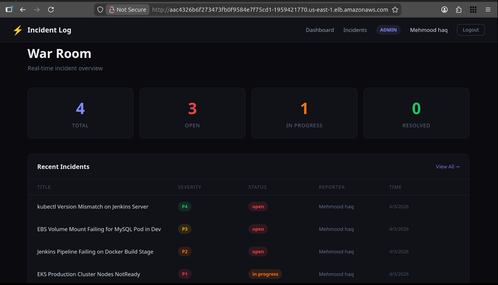
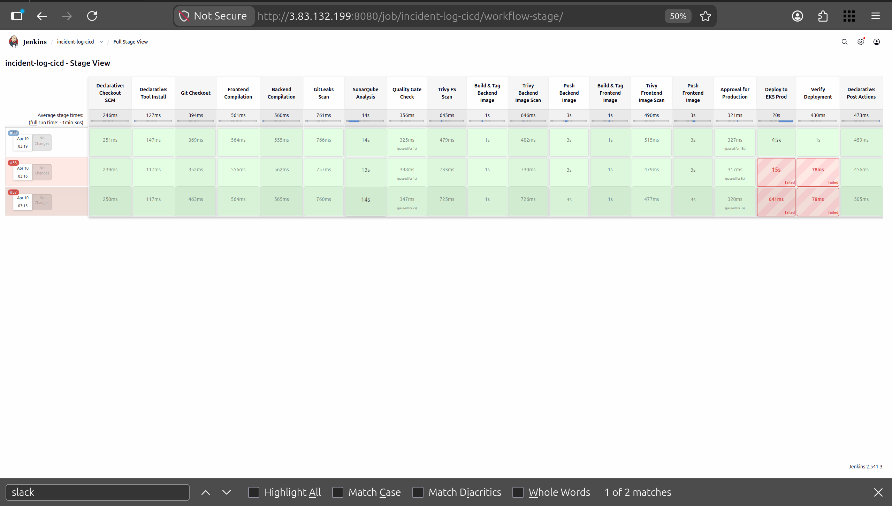
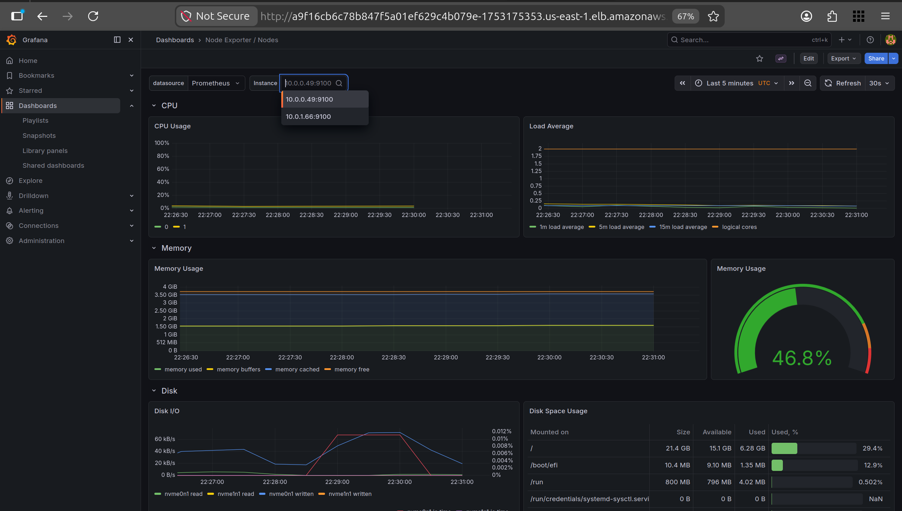
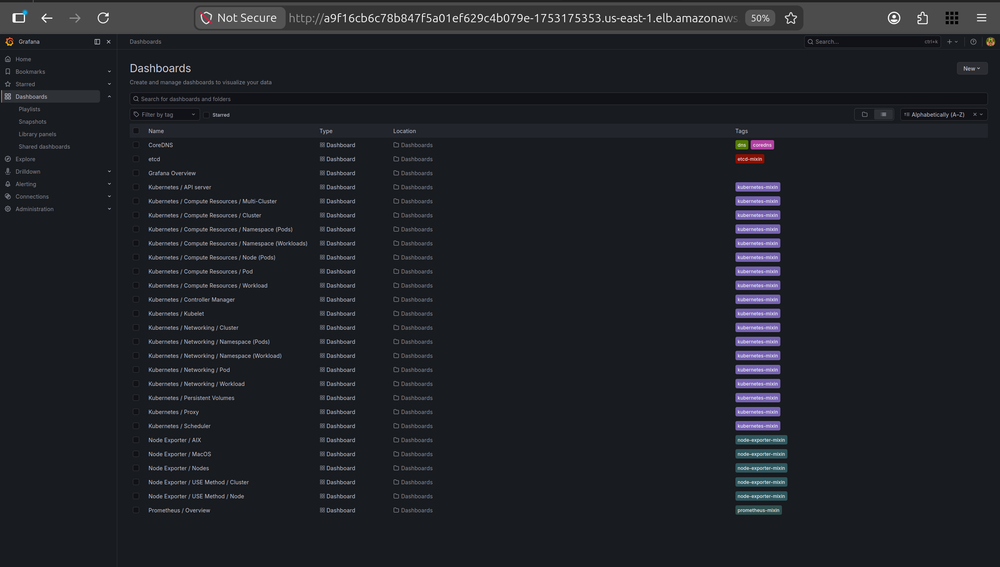
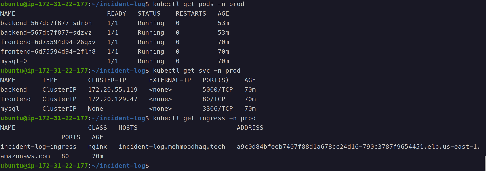

# ⚡ Incident Log

> A production-grade incident tracking app built with a complete DevSecOps pipeline — React + Node + MySQL deployed on AWS EKS.

## Application



Role-based incident management — log, track, resolve production incidents with P1–P4 severity.

---

## Stack

| Layer      | Tech                       |
| ---------- | -------------------------- |
| Frontend   | ReactJS + Nginx            |
| Backend    | ExpressJS + NodeJS + JWT   |
| Database   | MySQL 8 StatefulSet        |
| Infra      | AWS EKS + Terraform        |
| CI/CD      | Jenkins + Webhooks         |
| Security   | Gitleaks, Trivy, SonarQube |
| Monitoring | Prometheus + Grafana       |

---

## CI/CD Pipeline



`Push → Compile → Gitleaks → SonarQube → Trivy → Docker Build → Push → Approve → Deploy EKS → Slack`

---

## Security

| Tool        | Scans                              |
| ----------- | ---------------------------------- |
| Gitleaks    | Secrets in source code             |
| Trivy FS    | Vulnerable dependencies            |
| Trivy Image | CVEs in Docker image               |
| SonarQube   | Bugs, vulnerabilities, code smells |

---

## Monitoring




Prometheus + Grafana on EKS via Helm — pods, nodes, network metrics.

---

## Notifications


Jenkins sends success/failure notifications to Slack with build details.

---

## Kubernetes



```bash
prod namespace
├── frontend  (2 replicas)
├── backend   (2 replicas)
└── mysql     (StatefulSet + EBS)
```
