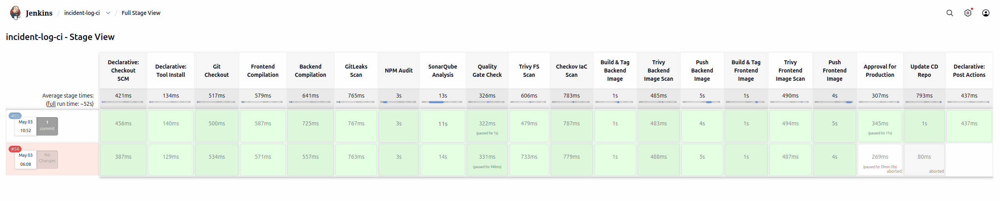
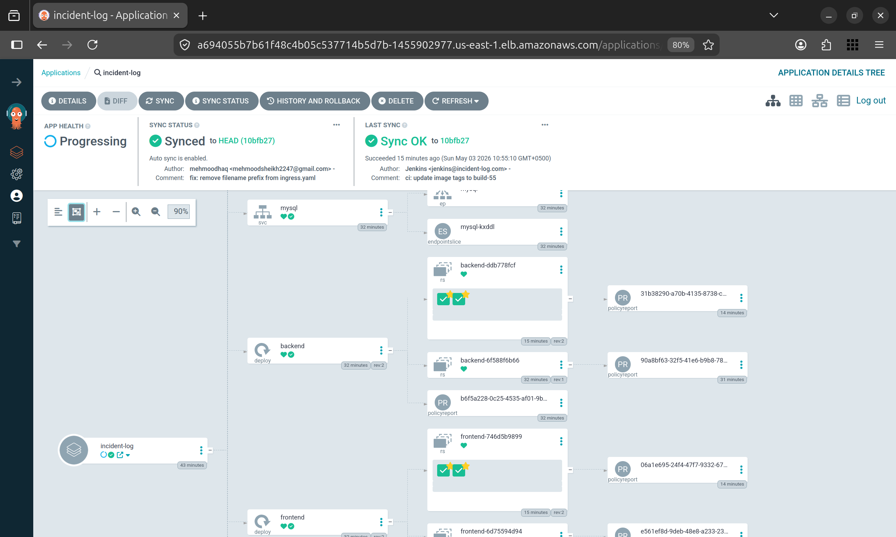
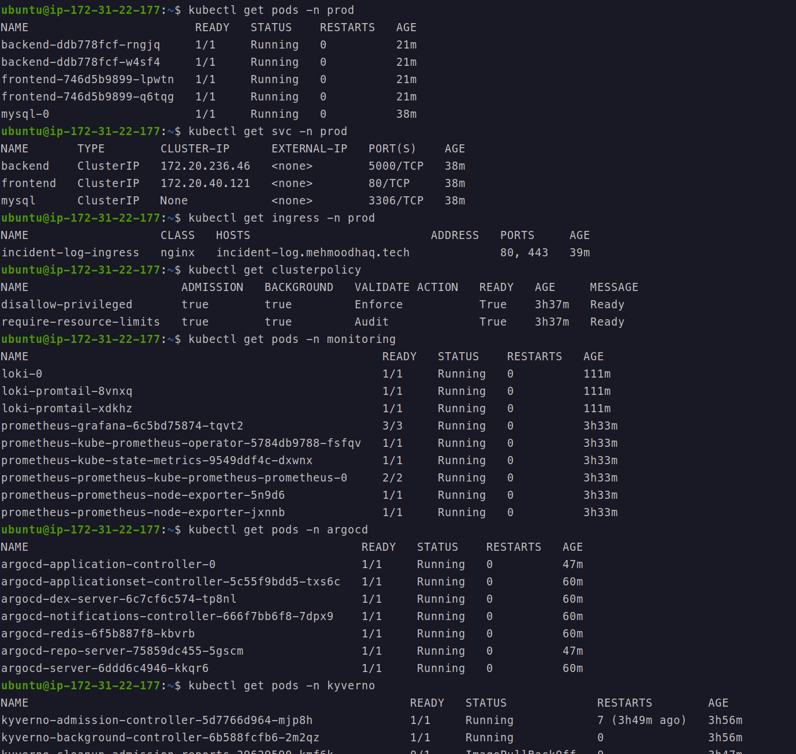
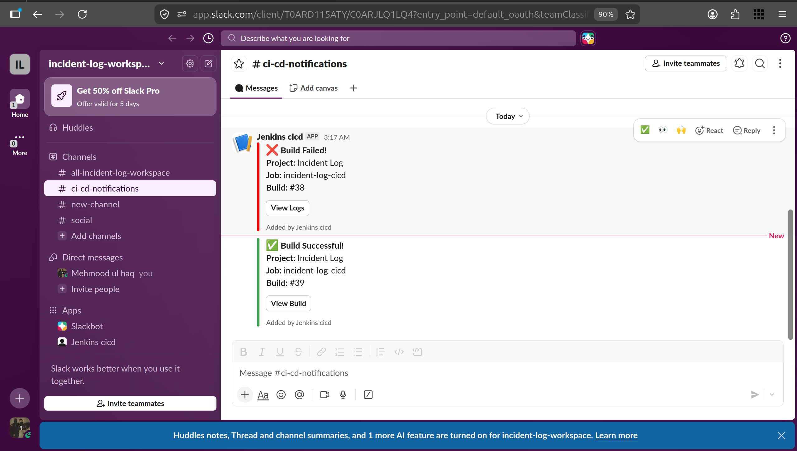
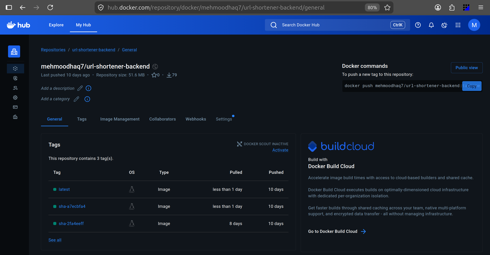

# Incident Log

A production incident tracking application deployed on AWS EKS using a fully automated DevSecOps workflow — covering infrastructure provisioning, security scanning at every pipeline stage, GitOps-driven continuous delivery, runtime policy enforcement, and unified observability.

> **Repos:** [incident-log](https://github.com/mehmoodhaq7/incident-log) (source + CI) · [incident-log-cd](https://github.com/mehmoodhaq7/incident-log-cd) (GitOps manifests)

---

## Pipeline Overview



Every `git push` to `main` triggers a 16-stage Jenkins pipeline. Security checks run before any image is built. No code reaches production without passing a manual approval gate.

```
Git Checkout
├── Frontend Compilation        syntax validation
├── Backend Compilation         syntax validation
├── Gitleaks Scan               hardcoded secrets detection
├── NPM Audit                   known vulnerable dependencies
├── SonarQube Analysis          static code analysis (SAST)
├── Quality Gate Check          pipeline fails if gate not passed
├── Trivy FS Scan               filesystem vulnerability scan
├── Checkov IaC Scan            Terraform + K8s manifest misconfigurations
├── Build Backend Image         docker multi-stage build, tagged :BUILD_NUMBER
├── Trivy Backend Image Scan    CVE scan on built image
├── Push Backend Image          push :BUILD_NUMBER + :latest to DockerHub
├── Build Frontend Image        docker multi-stage build, tagged :BUILD_NUMBER
├── Trivy Frontend Image Scan   CVE scan on built image
├── Push Frontend Image         push :BUILD_NUMBER + :latest to DockerHub
├── Manual Approval             human gate before any production change
└── Update CD Repo              Jenkins commits new image tags → ArgoCD syncs
```

---

## GitOps — Two-Repo Strategy



The cluster state is entirely driven by Git. Jenkins never touches the cluster directly.

**How it works:**

1. Jenkins builds and pushes images tagged with `BUILD_NUMBER` to DockerHub
2. Jenkins clones `incident-log-cd`, updates image tags via `sed`, and pushes a commit
3. ArgoCD detects the change via GitHub webhook and auto-syncs to the `prod` namespace
4. ArgoCD self-heals — any manual `kubectl` change is automatically reverted to match Git

```
incident-log        →   Jenkins CI   →   incident-log-cd   →   ArgoCD   →   EKS prod
(source + pipeline)      builds +         (K8s manifests)      syncs        (running pods)
                         pushes images    image tags updated
```

**Why GitOps:**

- Every deployment is a Git commit — full audit trail with author, timestamp, message
- Rollback = `git revert` — no manual kubectl commands needed
- Jenkins needs no cluster credentials — complete separation of CI and CD
- Drift detection — cluster is always reconciled back to what Git says

---

## Security

Security is enforced at three layers:

### 1. Pipeline — Shift-Left

| Stage      | Tool        | What it catches                                              |
| ---------- | ----------- | ------------------------------------------------------------ |
| Pre-build  | Gitleaks    | Hardcoded secrets, tokens, API keys in source code           |
| Pre-build  | NPM Audit   | Known CVEs in Node.js dependencies                           |
| Pre-build  | SonarQube   | Bugs, code smells, security hotspots — Quality Gate enforced |
| Pre-build  | Trivy FS    | Vulnerabilities across the project filesystem                |
| Pre-build  | Checkov     | Misconfigurations in Terraform and Kubernetes YAML           |
| Post-build | Trivy Image | CVEs inside the built Docker images                          |

### 2. Runtime — Kyverno Policy as Code

Kyverno ClusterPolicies enforce security at admission time — pods violating policies are rejected before scheduling:

- `disallow-privileged` — rejects any pod requesting `privileged: true` **(Enforce mode)**
- `require-resource-limits` — flags pods missing CPU/memory limits **(Audit mode)**

### 3. Container Hardening

- Backend runs as a **non-root user** (`appuser`) — created explicitly in Dockerfile
- **Multi-stage Docker builds** — production image contains only runtime artifacts
- `npm install --only=production` — dev dependencies never reach the image
- **Liveness and readiness probes** configured on backend deployment
- **CPU and memory limits** defined on all backend pods

---

## Infrastructure



All infrastructure is provisioned via **Terraform** — fully reproducible and version-controlled.

```
AWS EKS (us-east-1)
├── VPC — 2 public subnets (us-east-1a + us-east-1b)
├── Node Group — 2x t3.medium
├── EBS CSI Driver — OIDC + IRSA — gp3 StorageClass (Retain policy)
└── IAM — scoped roles for cluster, node group, and EBS CSI controller

Kubernetes (prod namespace)
├── frontend     Deployment — 2 replicas, ClusterIP
├── backend      Deployment — 2 replicas, ClusterIP, health probes, resource limits
├── mysql        StatefulSet — persistent EBS volume, headless service
└── ingress      NGINX — TLS via cert-manager (Let's Encrypt)

RBAC
└── Jenkins ServiceAccount with scoped Role + ClusterRole — least privilege
```

**Additional cluster components:**

| Component            | Namespace    | Purpose                                   |
| -------------------- | ------------ | ----------------------------------------- |
| ArgoCD               | argocd       | GitOps continuous delivery controller     |
| Kyverno              | kyverno      | Runtime policy enforcement                |
| Cert-Manager         | cert-manager | Automated TLS certificate provisioning    |
| Prometheus + Grafana | monitoring   | Metrics collection and dashboards         |
| Loki + Promtail      | monitoring   | Log aggregation across all pods and nodes |

---

## Observability




- **Prometheus** scrapes metrics from all pods and nodes via `kube-prometheus-stack`
- **Grafana** dashboards cover pod resource usage, node health, and deployment status
- **Loki + Promtail** — Promtail runs as a DaemonSet collecting logs from every pod; Loki stores them with EBS-backed persistence
- **Slack notifications** — pipeline sends rich build success/failure messages with direct links to Jenkins logs

---

## Repository Structure

```
incident-log/
├── api/                    ExpressJS backend
├── client/                 ReactJS frontend
├── k8s/
│   ├── manifests/          Kubernetes workload definitions
│   └── rbac/               ServiceAccount, Role, ClusterRole, Bindings
├── terraform/              EKS cluster, VPC, IAM, EBS addon
├── monitoring/             Helm values — Prometheus stack + Loki
├── security/kyverno/       ClusterPolicy definitions
├── mysql-init/             Database schema
├── docker-compose.yaml     Local development
└── Jenkinsfile             16-stage declarative pipeline

incident-log-cd/
└── k8s-prod/               Production manifests — ArgoCD source of truth
    ├── backend.yaml         ← image tag updated automatically by Jenkins
    ├── frontend.yaml        ← image tag updated automatically by Jenkins
    ├── mysql.yaml
    ├── namespace.yaml
    └── ingress.yaml
```

---

## DockerHub



Images are tagged with both `:latest` and `:BUILD_NUMBER` on every pipeline run — enabling rollback to any specific build.

- [`mehmoodhaq7/incident-log-backend`](https://hub.docker.com/r/mehmoodhaq7/incident-log-backend)
- [`mehmoodhaq7/incident-log-frontend`](https://hub.docker.com/r/mehmoodhaq7/incident-log-frontend)
